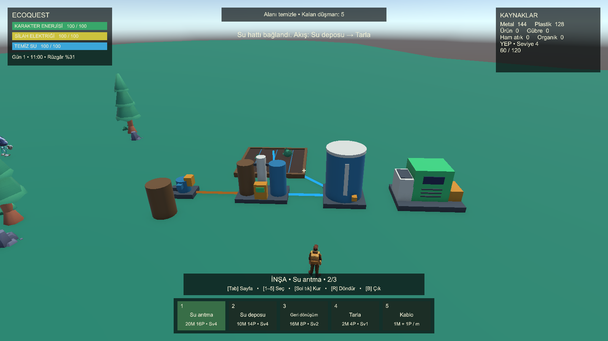

# İnşa ve üretim tesisleri

Bu düzenekler nihai harita değildir. Oyuncu MainScene'deki mevcut elektrik istasyonuyla başlayıp topladığı malzemelerle tesislerini kurar. Testlerde verilen malzemeler ve geçici tesis yerleşimleri yalnızca ayrı doğrulama sahnelerine aittir; başlangıç envanterine eklenmez.

## Kullanım

- **B:** inşa moduna gir/çık. Silah geçici olarak kaldırılır, çıkarken seçili araç geri gelir.
- **Tab:** sonraki yapı sayfası. **1–5:** o sayfadaki seçim. **R:** 90 derece döndür. **Sol fare:** kur veya bağlantı ucu seç.
- Yapıya bakarken **T:** tamir, **X:** kendi kurduğun yapıyı sök, **U:** uygun tesisi sonraki kademeye geliştir.
- Elektrik kablosunda önce iki tesisten birini, sonra diğerini seç. Kablo yönsüzdür; metre başına bir metal ve bir plastik harcar.
- Su borusunda **Q:** temiz/kirli su. Önce çıkış, ardından giriş tesisini seç. Boru yönlüdür; metre başına iki plastik harcar. Temiz/kirli hatlar birbirine karışmaz.
- Hat sökmek için ilgili kablo/boru seçiliyken ilk ucu seç, ikinci uca bak ve X kullan. Borunun su türü ve yönü kurulumu ile aynı olmalıdır.
- İnşa erişimi 8 m, tek hat uzunluğu en fazla 15 m. Metraj yukarı yuvarlanır. Yalnızca düz, boş ve temeli tamamen zemine oturan alanlara kurulabilir.
- Yapı ve hat sökümü malzemenin yarısını geri verir. Geliştirilmiş tesisin toplam yatırımı hesaba katılır. Başlangıç tesisleri sökülemez. Üzerinde bitki olan tarla önce hasat edilmeli/kuruyan bitkiler kaldırılmalıdır.

## Başlangıç yapı maliyetleri

Maliyetler ilk oynanış dengesi içindir; GDD'nin tanımladığı tesis açılış seviyeleri korunmuştur.

| Yapı | Metal | Plastik | YEP seviyesi | İşlev |
|---|---:|---:|---:|---|
| Güneş paneli | 12 | 6 | 1 | Güneş, bulut ve gölgeye göre elektrik |
| Rüzgâr türbini | 80 | 40 | 4 | Rüzgâra göre elektrik |
| Batarya | 8 | 6 | 1 | 250 elektrik depolar; yeni batarya boştur |
| Şarj istasyonu | 6 | 4 | 1 | Silah elektriğini bağlı şebekeden doldurur |
| Su pompası | 8 | 8 | 4 | Su kaynağından 4 birim/sn çeker; birim başına 0,5 elektrik |
| Su arıtma | 20 | 16 | 4 | Kirli suyu 3 birim/sn temizler; birim başına 2 elektrik |
| Su deposu | 10 | 14 | 4 | Toplam 300 su; temiz ve kirli ayrı haznelerde |
| Geri dönüşüm tesisi | 16 | 8 | 2 | 2 atık/sn işler; atık başına 1 şebeke elektriği |
| Tarla | 2 | 4 | 1 | 60 temiz su tamponu, ekilen bitkilere otomatik damla sulama |

Güneş paneli sınırı seviye başına iki adettir. Türbin dördüncü seviyede iki adetle açılır; her üç seviyede iki adet daha açılır. Diğer yapı türlerinin sınırı sekizdir. Mevcut başlangıç yapıları sınıra dahildir. Başarılı yapı kurma 12 YEP verir; başarısız denemeler malzeme veya YEP değiştirmez.

## Su zinciri

Pompa, mevcut bir WeaponWaterSource yüzeyinin en fazla üç metre yakınına kurulur. Pompa ve arıtma elektrik kablosu ister. Kirli kaynak → pompa → kirli su borusu → arıtma → temiz su borusu → depo → temiz su borusu → tarla zinciri çalışır. Temiz kaynak doğrudan temiz hatla depoya bağlanabilir.

Pompa 30, arıtma 80 birim tamponla başlar. Yeni tesisler boş kurulur. Depolarda kirli ve temiz su aynı toplam kapasiteyi paylaşır ama içerik karışmaz. Arıtma hacmi korur. Doluluk, boş girdi veya elektrik eksikliği üretimi sınırlar; kullanılmayan işlem için elektrik harcanmaz. Boru ayrımları kıt suyu talepleri oranında paylaşır. Döngülü bağlantılar aynı suyu bir kare içinde tekrar dolaştırıp çoğaltamaz.

Su tesisine yakından **E** ile yalnızca mevcut temiz sudan silah deposuna aktarılır. Vakumun toplama modu temiz su yoksa kirli su da çekebilir; HUD bunun kirli olduğunu gösterir. Silah deposundaki kirli suya temiz su eklemek mevcut kirliliği ortadan kaldırmaz. Tarla otomatik sulamada kirli su kabul etmez; yalnızca kendi sınırlarındaki canlı bitkileri %80 nem hedefine kadar sular. Yeterince nemli, kurumuş veya olmayan bitkiler su harcatmaz.

## Geri dönüşüm ve tesis kademeleri

Geri dönüşüm tesisine **E** önce hazır ürünleri alır, ardından envanterdeki ham metal/plastik/organik atıkları boş kapasite kadar bırakır. İşleme silah bataryasından değil şebekeden beslenir. Kesintide kısmi ilerleme korunur. Birim başına 2 YEP ve organik atığın gübre dönüşümü ürünler alınırken bir kez uygulanır. Dolu tesise sığmayan atık oyuncuda kalır. Tesis sökülürken ham ve hazır içerikler geri alınır.

Geri dönüşüm kademeleri YEP **2/6/12**, su pompası/arıtma/depo kademeleri **4/12/24** seviyelerinde açılır. İkinci kademe temel malzeme maliyetinin iki, üçüncü kademe üç katını ister; her kademe kapasiteyi ve varsa işlem hızını ikiye katlar. Mevcut su ve malzeme korunur. Hasarlı tesis önce tamir edilmelidir; tamir bedeli toplam yatırımla ve eksik sağlamlıkla orantılıdır.

## Doğrulama ve devam eden kapsam

ConstructionCheck yerleştirme/çakışma, silah kilidi, maliyet/seviye sınırı, kablo ve sökümü; WaterInfrastructureCheck su/elektrik korunumu, dallanma/döngü, gerçek inşa ve silaha dolumu; FacilityCheck geri dönüşüm, kademeler, sulama ve içerik iadesini denetler. FacilityVisualCheck gerçek inşa API'siyle kurulan modelleri ve sayfalı HUD'u render eder. Test kaynakları Tools/UnityChecks altındadır.

26 Eylül 2026 doğrulaması: WaterInfrastructureCheck 43, ConstructionCheck 26, PowerCheck 26, FacilityCheck 32 kontrol geçti. Son görsel doğrulamada tank kapağındaki çakışan yüzey düzeltildi; inşa sayfasının başlıkları, maliyetleri ve HUD okunabilir bulundu. Aşağıdaki görüntü ayrı denetim sahnesinin kurulumudur; MainScene'e bu yerleşim kaydedilmedi.

Tam dünya kaydı henüz yoktur. F5/F9 geçici oyuncu envanterini kaydeder; kurulan tesislerin, içeriğin ve bağlantıların kalıcı kaydı yol haritasının 11. aşamasındadır. Market, çevre etkileri, ayrıntılı tarım türleri ve düşmanların yapılara saldırısı kendi sıradaki aşamalarında eklenecektir.
