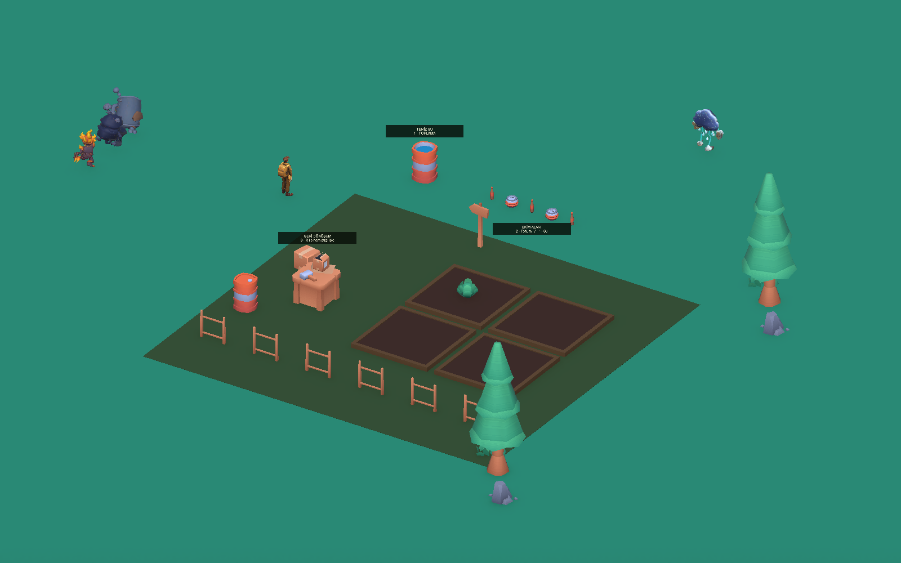

# Ücretsiz saha görselleri

Bu değişiklik, boş test alanını oynanış noktaları anlaşılır bir saha istasyonuna dönüştürmek için Kenney'nin iki paketinden seçilmiş 14 modeli kullanır. Paketlerin kaynak dosyaları `Assets/ThirdParty/Kenney` altındadır. Tam arşivler veya kullanılmayan yüzlerce model Assets'e eklenmez.

Görüntüdeki bitkiler doğrulama sırasında ekilip büyütülmüştür; yeni oyun boş ekim yataklarıyla başlar.

## Kaynak ve lisans

| Paket | Sürüm / paket içindeki oluşturulma tarihi | Kullanılan modeller | Yerel lisans |
| --- | --- | --- | --- |
| [Kenney Survival Kit](https://kenney.nl/assets/survival-kit) | 2.0 / 3 Nisan 2024 | 11 FBX: barrel, barrel-open, box, box-open, workbench, fence, signpost-single, tree, rock-a, grass, patch-grass | `Assets/ThirdParty/Kenney/Survival/License.txt` |
| [Kenney Food Kit](https://kenney.nl/assets/food-kit) | 2.0 / 26 Haziran 2024 | 3 FBX: cabbage, soda-can-crushed, soda-bottle | `Assets/ThirdParty/Kenney/Food/License.txt` |

Her iki paketin birlikte gelen lisansı **Creative Commons Zero (CC0)** olarak belirtilmiştir. Paket metinleri kişisel, eğitim ve ticari kullanıma izin verdiğini, Kenney adını belirtmenin zorunlu olmadığını söyler. Orijinal `License.txt` dosyaları kaynaklarla birlikte korunur; isteğe bağlı kaynak kredisi: **Kenney — www.kenney.nl**. Her paketin kendi `Textures/colormap.png` dosyası da korunur.

Resmî sayfalardaki ücretsiz indirmelerden kullanılan arşivler: [Survival Kit ZIP](https://kenney.nl/media/pages/assets/survival-kit/4065a8185b-1712149243/kenney_survival-kit.zip) ve [Food Kit ZIP](https://kenney.nl/media/pages/assets/food-kit/83086fa91c-1719418518/kenney_food-kit.zip). İndirme adresleri paket güncellendiğinde değişebilir; yeniden edinmek için üstteki resmî paket sayfaları kullanılabilir.

## Unity düzenlemesi

`Assets/Scripts/Editor/BuildEcoArt.cs` içindeki **EcoQuest → Build field station art** menüsü `Assets/Resources/EcoArt` altında URP malzemeleri, boyutlandırılmış model prefabları ve `FieldStation.prefab` üretir. Kaynak FBX dosyalarının animasyonu ve otomatik malzeme içe aktarımı kapatılır; görseller paketin kendi renk paletini kullanır. Prefab kökleri zemin seviyesine alınır ve boyutlar metre cinsinden düzenlenir. İlgili nesnelere etkileşim ve engel collider'ları eklenir.

Üretilen prefablar kaynak projeyle birlikte tutulmalıdır. `EcoWorldArt.Spawn`, bitki ve ganimet gibi çalışma sırasında oluşturulan nesneleri buradan yükler. `BuildEcoArt.Build` açık sahneyi değiştirmez; saha istasyonunun MainScene içindeki yerleşimi ayrı bir prefab örneğidir.

## Yerleşim ve kullanım

İstasyonun çalışma alanı başlangıcın sağında ve arkasında, yaklaşık x=2–10 ve z=-6–3 aralığındadır. Ana spawn ve düşman yaklaşım alanı açık bırakılır.

| Konum | Nesne ve oynanış işlevi |
| --- | --- |
| x=2.2, z=2.5 | Açık varil ve görünür temiz su yüzeyi; Vakum / Toplama ile depoyu doldurur. |
| x=3.5–6.25, z=2.5 | Üç ezilmiş metal kutu ve üç plastik şişe; ayrı ayrı toplanabilir veya geri dönüştürülebilir. Her kutu 2 metal, her şişe 1 plastik verir. |
| x=6.1 veya 8.4, z=-1.7 veya -4 | Dört toprak ekim yatağı; tohum mermileri burada lahana oluşturur. |
| x=3.2, z=-3.6 civarı | Çalışma tezgâhı, depolama varili ve kutular; geri dönüşüm alanını görsel olarak belirtir. Tezgâh ayrı bir menü açmaz; 3 seçiliyken R ham atıkları işler. |
| z=-6.5 ve alanın dış kenarları | Çit, ağaç, kaya ve otlar; alanın sınırını ve istasyonun çevresini belirtir. |

Lahana görseli büyüdükçe genişler; kökü toprak seviyesinde kalır. Temiz, kirlenmiş ve kurumuş durumları renk tonuyla ayrılır. Düşman ganimetinde metal için ezilmiş kutu, plastik için şişe kullanılır; bu nesneler küçük bir dönme ve süzülme hareketiyle fark edilir. Düşmanların mevcut karakter ve mermi modelleri korunur.

MainScene'deki `Eco Field Station` nesnesi Inspector ve Scene görünümünden düzenlenebilir. `EcoPracticeArea`, eski sahnelerde istasyon bulunmazsa prefabı oluşturur; mevcut istasyona ikinci bir kopya eklemez. Sahneye yerleştirilen tezgâh ve depolama dekorları ile toplanabilir kutu/şişeler farklı nesnelerdir.

## Kontrol

24 Eylül 2026'da Unity 6000.0.74f1 ile projenin ayrı test kopyasında MainScene açılarak Play Mode doğrulandı: beş düşman, çizgisiz saldırı bileşenleri, altı kaynak nesnesi, dört ekim yatağı ve modellerin tüm malzeme bağlantıları kontrol edildi. Gerçek nişan ışınıyla metal kutu toplandı, lahana sulandı ve varilden su dolduruldu; tohum mermisi bir ekim yatağına çarparak lahana oluşturdu. Lahananın büyürken topraktan yükselmediği ve üç tabelanın kameraya döndüğü doğrulandı. Sahne kamera görüntüsü ayrıca render edilip incelendi.

Adım adım kullanıcı kontrolü `PlayerWeapons.md` içindedir. Bu doğrulama mevcut prototip alanını kapsar; tüm harita için rota bulma veya sanat çalışmasının tamamlandığı anlamına gelmez.
