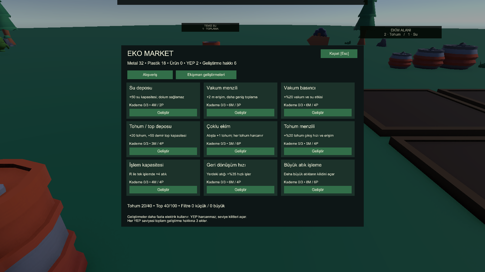

# Market ve ekipman geliştirmeleri

MainScene'deki mevcut saha istasyonunun çalışma tezgâhı artık markettir. Yakından E ile açılır, fareyle işlem seçilir; Esc veya Kapat ile çıkılır. Silah kaldırılır, hareket/bakış/inşa/ateş girdileri engellenir. Kapanış tıklaması ateşe dönüşmez. Uzaklaşma, marketin kaldırılması veya karakterin toparlanması menüyü kapatır. Market zamanı durdurmaz. Sonraki menü/duraklatma aşaması bu kuralları merkezi arayüz sistemine taşıyacaktır.

Yeni dış kaynaklı model üretilmedi. Mevcut Kenney tezgâhı kullanıldı; üzerindeki kutu aynı etkileşim köküne alındı. SetupEcoMarket.Build saha prefabını günceller; BuildEcoArt da yeniden oluştururken bu bağlantıyı korur.

## Alışveriş

| İşlem | Maliyet / gelir | En erken YEP |
|---|---|---:|
| 5 demir top al | 1 metal | 1 |
| 5 lahana tohumu al | 2 plastik | 1 |
| 5 havuç tohumu al | 3 plastik | 2 |
| 5 domates tohumu al | 4 plastik | 4 |
| 5 ağaç tohumu al | 5 plastik | 2 |
| Küçük hava filtresi al | 3 metal + 2 plastik | 2 |
| Büyük hava filtresi al | 12 metal + 8 plastik | 4 |
| 1 hasat ürünü sat | +1 metal +1 plastik | 1 |
| Seçili türden 5 tohum sat | +1 plastik | 1 |

Fiyatlar ilk oynanış dengesi içindir. Alış/satış farkı satın alıp hemen satarak malzeme üretmeyi önler. YEP alışverişte harcanmaz veya kazanılmaz. Bedel ve kapasite birlikte doğrulanır; başarısız işlem kısmi ödeme, kayıp ürün veya negatif envanter oluşturmaz. Başlangıç kapasiteleri 40 tohum ve 100 demir toptur. Filtre sınırı 20 küçük/10 büyük adettir.

GDD'ye uygun olarak demir toplar marketten alınır; eski R ile mermi üretimi kaldırıldı. R geri dönüşüm/gübreleme işlevini korur. Hasatta tohum kapasitesi yetersizse bitki ve ürün yerinde kalır; oyuncu fazla tohumları satabilir veya depoyu geliştirebilir.

Küçük ve büyük filtrelerin alışverişi, ayrı envanteri ve kaydı hazırdır. Teneke'ye küçük filtre takma 9. aşamada; fabrika filtresi ve çevreye etkisi 7. aşamada bağlanacaktır. Filtre satın alınması bu sonraki mekaniklerin tamamlandığı anlamına gelmez.

## Dokuz geliştirme

Her özellik üç kez geliştirilebilir; ilk, ikinci ve üçüncü kademe YEP 2/6/12 seviyelerinde açılır. Toplam alınabilecek geliştirme sayısı YEP seviyesinin üç katıdır. Kullanılmayan haklar birikir. İlk kademe aşağıdaki maliyeti kullanır; sonraki kademeler sırasıyla iki ve dört katını ister.

| Özellik | Kademe başına etki | İlk bedel (metal/plastik) |
|---|---|---|
| Su deposu | +50 su kapasitesi; mevcut su miktarı artmaz | 4 / 2 |
| Vakum menzili | +2 metre erişim, +0,15 m toplama yarıçapı | 6 / 3 |
| Vakum basıncı | +%20 etkili vakum hasarı ve sulama etkisi | 6 / 4 |
| Tohum/top deposu | +20 tohum, +50 top kapasitesi | 3 / 4 |
| Çoklu ekim | Atış başına +1 fiziksel tohum | 5 / 6 |
| Tohum menzili | +%20 tohum çıkış hızı; aynı uçuş süresinde daha uzağa erişir | 5 / 4 |
| İşlem kapasitesi | R ile tek işlemde +4 ham atık | 4 / 4 |
| Geri dönüşüm hızı | Yerdeki atık üzerinde +%35 işlem hızı | 6 / 4 |
| Büyük atık işleme | Bir sonraki büyük atık sınıfını açar | 8 / 6 |

Her satın alınan kademe ilgili silahın elektrik tüketimine temel değerinin %10'unu ekler. Tohum atışları her fiziksel tohum için ayrı tohum ve elektrik öder; kaynak azsa karşılanabilen sayıda atar. Çoklu ekim demir top atışını çoğaltmaz. Geri dönüşümün envanter işlemi hem yeni parti sınırına hem mevcut elektriğe uyar. Tarayıcının geliştirmesi yoktur.

Saha istasyonunun atık tarafında, mevcut ezilmiş metal modeliyle üç daha büyük atık eklendi. Her biri ayrı işleme kademesi gerektirir; vakumla alıp kilidi atlama mümkün değildir. Temel dokuz metal/plastik/organik kaynak yeni başlayan oyuncuya açık kalır.

F5/F9 geçici kaydı geliştirme kademelerini ve filtreleri de içerir. Yüklemede su kapasitesi önce geri kurulur; büyük depodaki su yanlışlıkla temel kapasiteye kırpılmaz. Eski kayıtlar eksik geliştirme alanını sıfır kademe olarak yükler. Tam dünya kaydı 11. aşamanın kapsamındadır.

## Doğrulama

MarketCheck gerçek MainScene tezgâhı, E etkileşimi, satın alma butonu, erişim/enerji/seviye/kapasite sınırları, menü girdi kilidi, fiziksel çoklu tohum, vakum erişimi/basıncı, büyük atık işleme ve kayıt turunu denetler. ResourceProgressionCheck mevcut kaynak döngüsünü; WeaponRuntimeCheck temel silah davranışlarını koruma kontrolünü yapar. MarketVisualCheck alışveriş ve dokuz özellikli geliştirme sayfalarını render eder. Kaynaklar Tools/UnityChecks altındadır.

27 Eylül 2026: MarketCheck 67, ResourceProgressionCheck 40, WeaponRuntimeCheck 39 kontrol geçti. İki market ekranı 1600×900 görüntüde incelendi; arkadaki oyun HUD'unun menüye karışması giderildi. Test ekranındaki malzeme ve YEP değerleri yalnızca doğrulama oturumuna aittir, başlangıç envanteri değiştirilmedi.

